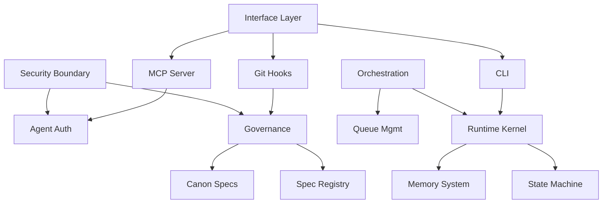

# CO_OS_CAPABILITY_MAP

**Document ID**: CO_OS_CAPABILITY_MAP  
**Type**: Structural  
**Scope**: Company OS  
**Status**: Active  
**Version**: 0.1.0  
**Owner**: Platform Engineering

---

## 0. Purpose

This document enumerates **all capabilities the Company OS must provide**.

Goals:
- Prevent missing system responsibilities
- Serve as a checklist for implementation completeness
- Define clear boundaries between OS capabilities and project responsibilities

---

## 1. Capability Overview

```
┌─────────────────────────────────────────────────────────────────┐
│                    AI Workflow OS Capabilities                   │
├─────────────────────────────────────────────────────────────────┤
│  ┌─────────────┐  ┌─────────────┐  ┌─────────────┐             │
│  │ Orchestration│  │ Governance  │  │   Memory    │             │
│  │   Engine    │  │   Layer     │  │   System    │             │
│  └─────────────┘  └─────────────┘  └─────────────┘             │
│                                                                  │
│  ┌─────────────┐  ┌─────────────┐  ┌─────────────┐             │
│  │   Runtime   │  │  Interface  │  │  Security   │             │
│  │   Kernel    │  │    Layer    │  │  Boundary   │             │
│  └─────────────┘  └─────────────┘  └─────────────┘             │
└─────────────────────────────────────────────────────────────────┘
```

---

## 2. Capability Details

### 2.1 Orchestration Engine

| Capability | Description | Implementation | Status |
|------------|-------------|----------------|--------|
| **Task Routing** | Route tasks to appropriate queues | `kernel/os.py` | ✅ |
| **Queue Management** | Manage task queues (research/data/dev/gov) | `state/tasks.yaml` | ✅ |
| **Concurrency Control** | Enforce queue locks and concurrency rules | `cmd_task_start()` | ✅ |
| **Priority Scheduling** | Task priority and scheduling | `kernel/os.py`, `task_parser.py` | ✅ |
| **Agent Coordination** | Multi-agent task assignment | `kernel/agent_auth.py` | ✅ |

**Key Files**:
- [kernel/os.py](../kernel/os.py) - CLI and task routing
- [state/tasks.yaml](../state/tasks.yaml) - Task state persistence

---

### 2.2 Governance Layer

| Capability | Description | Implementation | Status |
|------------|-------------|----------------|--------|
| **Canon Enforcement** | Enforce L0 Company Canon specs | `specs/canon/` | ✅ |
| **Framework Specs** | Provide L1 Framework specifications | `specs/framework/` | ✅ |
| **Spec Registry** | Track all specs with versioning | `spec_registry.yaml` | ✅ |
| **Decision Logging** | Record governance decisions | `ops/decision-log/` | ✅ |
| **Freeze Records** | Track blueprint freezes | `docs/BLUEPRINT_FREEZE_RECORD.md` | ✅ |
| **Deviation Tracking** | Log spec deviations | `ops/deviations/` | ✅ |
| **Proposal Workflow** | Canon/Framework change proposals | `ops/proposals/` | ✅ |

**Key Files**:
- [specs/canon/GOVERNANCE_INVARIANTS.md](../specs/canon/GOVERNANCE_INVARIANTS.md)
- [specs/canon/AUTHORITY_CANON.md](../specs/canon/AUTHORITY_CANON.md)
- [spec_registry.yaml](../spec_registry.yaml)

---

### 2.3 Memory System

| Capability | Description | Implementation | Status |
|------------|-------------|----------------|--------|
| **Git Source of Truth** | All state in git-tracked files | `.git/` | ✅ |
| **Structured State** | YAML-based state management | `state/*.yaml` | ✅ |
| **Audit Trail** | Complete execution history | `ops/audit/` | ✅ |
| **Event Sourcing** | Task lifecycle events | `state_store.py` | ✅ |
| **Knowledge Base** | Searchable docs/specs | `docs/`, `specs/` | ✅ |

**Key Files**:
- [kernel/state_store.py](../kernel/state_store.py) - State persistence
- [kernel/audit.py](../kernel/audit.py) - Audit logging
- [state/](../state/) - Runtime state directory

---

### 2.4 Runtime Kernel

| Capability | Description | Implementation | Status |
|------------|-------------|----------------|--------|
| **State Machine Engine** | Task lifecycle transitions | `kernel/state_machine.yaml` | ✅ |
| **Transition Validation** | Validate legal state changes | `can_transition()` | ✅ |
| **Task Lifecycle** | new → start → finish → merge | `kernel/os.py` | ✅ |
| **Spec-aware Execution** | Validate tasks against specs | `validate_taskcard()` | ✅ |
| **TaskCard Parsing** | Parse and validate TaskCards | `kernel/task_parser.py` | ✅ |

**State Machine States**:
```yaml
states:
  - draft      # Initial state
  - ready      # Ready for execution
  - running    # In progress
  - reviewing  # Awaiting review
  - merged     # Merged to main
  - released   # Deployed to production
  - blocked    # Blocked by dependency
  - abandoned  # Cancelled
```

**Key Files**:
- [kernel/state_machine.yaml](../kernel/state_machine.yaml)
- [kernel/task_parser.py](../kernel/task_parser.py)

---

### 2.5 Interface Layer

| Capability | Description | Implementation | Status |
|------------|-------------|----------------|--------|
| **CLI Interface** | Command-line operations | `kernel/os.py` | ✅ |
| **MCP Server** | AI agent protocol interface | `kernel/mcp_server.py` | ✅ |
| **MCP Stdio Transport** | Standard I/O MCP transport | `kernel/mcp_stdio.py` | ✅ |
| **Git Hooks** | Pre-commit/pre-push enforcement | `hooks/` | ✅ |
| **CI/CD Pipeline** | Automated gate checks | `.github/workflows/` | ⏳ |
| **Gate Checker** | Pipeline gate validation | `scripts/gate_check.py` | ✅ |

**MCP Tools Exposed** (12 total):
| Tool | Category | Description |
|------|----------|-------------|
| `agent_register` | Agent | Register new AI agent |
| `session_create` | Session | Create authorized session |
| `session_validate` | Session | Validate session |
| `session_terminate` | Session | End session |
| `task_list` | Task | List tasks |
| `task_get` | Task | Get task details |
| `task_start` | Task | Start task |
| `task_finish` | Task | Complete task |
| `governance_check` | Governance | Verify compliance |
| `artifact_read` | Artifact | Read file |
| `artifact_list` | Artifact | List directory |
| `spec_list` | Spec | List specs |

**Key Files**:
- [kernel/mcp_server.py](../kernel/mcp_server.py)
- [kernel/mcp_stdio.py](../kernel/mcp_stdio.py)
- [hooks/pre-commit](../hooks/pre-commit)
- [hooks/pre-push](../hooks/pre-push)

---

### 2.6 Security & Trust Boundary

| Capability | Description | Implementation | Status |
|------------|-------------|----------------|--------|
| **Agent Authentication** | Verify agent identity | `kernel/agent_auth.py` | ✅ |
| **Session Management** | Token-based sessions | `AgentAuthManager` | ✅ |
| **Role Mode Enforcement** | architect/planner/executor/builder | `RoleMode` enum | ✅ |
| **Least-Privilege Tokens** | Scoped permissions | Session task_scope | ✅ |
| **Governance Gate** | Output compliance check | `kernel/governance_gate.py` | ✅ |
| **Audit Logging** | Full action traceability | `kernel/audit.py` | ✅ |
| **Environment Isolation** | Separate execution contexts | Planned | ⏳ |

**Role Modes**:
| Mode | Authority Level | Capabilities |
|------|-----------------|--------------|
| `architect` | High | Define structure, specs |
| `planner` | Medium | Plan tasks, decompose work |
| `executor` | Low | Execute defined tasks |
| `builder` | Medium | Implement features |

**Key Files**:
- [kernel/agent_auth.py](../kernel/agent_auth.py)
- [kernel/governance_gate.py](../kernel/governance_gate.py)
- [docs/SECURITY_TRUST_BOUNDARY.mmd](SECURITY_TRUST_BOUNDARY.mmd)

---

## 3. Implementation Completeness Matrix

| Category | Total | ✅ Done | ⏳ Planned | Coverage |
|----------|-------|---------|-----------|----------|
| Orchestration | 5 | 5 | 0 | 100% |
| Governance | 7 | 7 | 0 | 100% |
| Memory | 5 | 5 | 0 | 100% |
| Runtime | 5 | 5 | 0 | 100% |
| Interface | 6 | 5 | 1 | 83% |
| Security | 7 | 6 | 1 | 86% |
| **TOTAL** | **35** | **33** | **2** | **94%** |

---

## 4. Gap Analysis

### 4.1 Missing Capabilities (Planned)

| Gap | Category | Priority | Notes |
|-----|----------|----------|-------|
| CI/CD Pipeline | Interface | P1 | GitHub Actions workflows |
| Environment Isolation | Security | P2 | Container/sandbox isolation |

### 4.2 Enhancement Opportunities

| Enhancement | Category | Benefit |
|-------------|----------|---------|
| Real-time notifications | Interface | Agent awareness |
| Spec dependency graph auto-gen | Governance | Impact analysis |
| Performance metrics | Runtime | Observability |

---

## 5. Capability Dependencies



---

## 6. References

- [ARCH_BLUEPRINT_MASTER.mmd](ARCH_BLUEPRINT_MASTER.mmd) - System architecture
- [KERNEL_V0_RUNTIME_FLOW.mmd](KERNEL_V0_RUNTIME_FLOW.mmd) - Runtime flow
- [INTERFACE_LAYER_MAP.mmd](INTERFACE_LAYER_MAP.mmd) - Interface boundaries
- [SECURITY_TRUST_BOUNDARY.mmd](SECURITY_TRUST_BOUNDARY.mmd) - Security model

---

## 7. Change Log

| Date | Version | Change |
|------|---------|--------|
| 2026-02-01 | 0.1.0 | Initial capability map |
