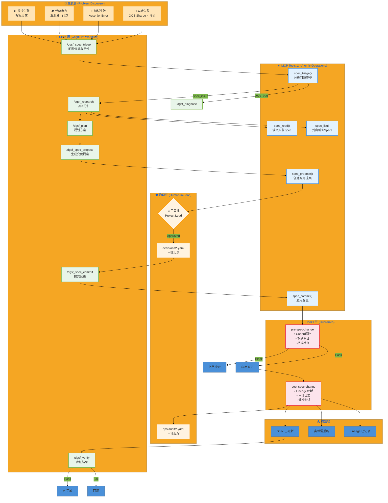

---

# Spec Evolution Workflow 架构说明

## 1. 层次职责

| 层 | 职责 | 实现位置 | VS Code 集成 |
|---|------|---------|-------------|
| **Triggers** | 问题发现 | 实验结果、测试输出、代码审查 | Problems Panel, Test Explorer |
| **Skills** | 认知流程编排 | `.github/prompts/dgsf_spec_*.prompt.md` | Copilot Chat 命令 |
| **MCP Tools** | 原子操作 | `kernel/mcp_server.py` | Copilot 自动调用 |
| **Hooks** | 强制检查点 | `hooks/pre-spec-change`, `hooks/post-spec-change` | Git hooks, 手动触发 |
| **Governance** | 人工审批 | `decisions/*.yaml` | PR Review, 手动创建 |

## 2. 权限矩阵

| Spec 层级 | 路径模式 | AI 可提议 | AI 可提交 | 审批者 |
|----------|---------|----------|----------|--------|
| L0 Canon | `specs/canon/*` | ❌ | ❌ | Project Owner (freeze) |
| L1 Framework | `specs/framework/*` | ✅ | ❌ | Platform Engineer |
| L2 Project | `projects/*/specs/*` | ✅ | ❌ | Project Lead |
| L3 Experiment | `experiments/*/config.yaml` | ✅ | ✅* | Auto (threshold pass) |

*L3 自动提交需通过阈值验证

## 3. 数据流

```
问题 → Triage → Research → Plan → Propose → [Approval] → Commit → Verify
                                      ↓
                              decisions/SCP-*.yaml
                                      ↓
                              ops/audit/spec_commits.yaml
                                      ↓
                              projects/dgsf/lineage/spec_changes.yaml
```

## 4. VS Code + Copilot 使用指南

### 4.1 触发 Spec Triage

在 Copilot Chat 中输入：
```
/dgsf_spec_triage
问题：实验 t05 的 OOS Sharpe = 0.8，低于阈值
来源：experiment
```

### 4.2 读取 Spec

```
读取 projects/dgsf/specs/SDF_INTERFACE_CONTRACT.yaml 的 validation 部分
```

### 4.3 提出 Spec 变更

```
/dgsf_spec_propose
修改 SDF_INTERFACE_CONTRACT.yaml
将 min_sharpe_threshold 从 1.0 改为 1.5
理由：行业标准要求生产级 SDF 模型 Sharpe >= 1.5
```

### 4.4 提交变更（需先获得审批）

```
/dgsf_spec_commit
提案 ID: SCP-2026-02-04-001
审批参考: PR#42 或 decisions/APPROVED.yaml
```

## 5. 文件清单

### 新增 Skills (Prompts)
- `.github/prompts/dgsf_spec_triage.prompt.md`
- `.github/prompts/dgsf_spec_propose.prompt.md`
- `.github/prompts/dgsf_spec_commit.prompt.md`

### 新增 MCP Tools
- `spec_read` - 读取 Spec 内容
- `spec_propose` - 创建变更提案
- `spec_commit` - 提交已批准变更
- `spec_triage` - 问题分类

### 新增 Hooks
- `hooks/pre-spec-change` - 变更前验证
- `hooks/post-spec-change` - 变更后操作

### 测试文件
- `projects/dgsf/tests/test_spec_evolution_e2e.py`
- `projects/dgsf/scripts/validate_spec_workflow.py`
