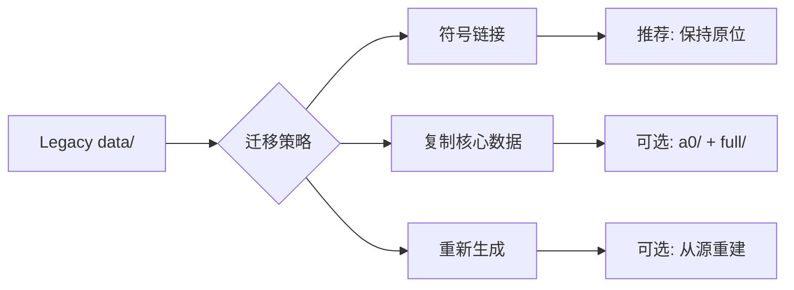

# 🗄️ DGSF 数据资产清点报告

**文档 ID**: DATA_ASSET_INVENTORY  
**评估人**: 王数据 (首席数据工程师)  
**日期**: 2026-02-01  
**状态**: ✅ COMPLETED

---

## 0. 执行摘要

| 维度 | 数值 | 说明 |
|------|------|------|
| **总文件数** | 327 | 跨 11 个子目录 |
| **总数据量** | 1,252.56 MB | ~1.25 GB |
| **活跃数据** | ~527 MB | a0 + full + final |
| **完整性** | ⭐⭐⭐⭐ (4/5) | 核心数据完整 |
| **可用性** | ⭐⭐⭐⭐⭐ (5/5) | Parquet 格式，即用 |

### 🎯 核心结论
> **数据资产完整且可直接使用**。核心数据目录 (a0, full, final) 包含完整的 A 股市场数据、因子面板、SDF 特征等，覆盖数据工程 v4.2 规范要求。

---

## 1. 数据目录结构

### 1.1 目录统计

| 目录 | 文件数 | 大小 (MB) | 状态 | 用途 |
|------|--------|-----------|------|------|
| `a0/` | 21 | 125.66 | ✅ 活跃 | A0 研究数据集 |
| `full/` | 26 | 398.25 | ✅ 活跃 | 完整窗口数据 |
| `final/` | 4 | 2.73 | ✅ 活跃 | 最终处理结果 |
| `cache/` | 3 | 295.08 | 📦 缓存 | 计算缓存 |
| `deprecated/` | 236 | 400.27 | ❌ 废弃 | 历史版本 |
| `interim/` | 12 | 28.50 | ⚠️ 中间 | 中间数据 |
| `paneltree/` | 5 | 0.51 | ✅ 活跃 | PanelTree 输出 |
| `paneltree_v2/` | 5 | 0.31 | ✅ 活跃 | PanelTree v2 |
| `external/` | 2 | 0.22 | 📁 外部 | 外部数据源 |
| `processed/` | 3 | 0.07 | ✅ 活跃 | 已处理数据 |
| `raw/` | 7 | 0.06 | 📁 原始 | 原始数据 |

### 1.2 数据流水线层级

```
raw/ (L0 原始)
  ↓
a0/ / full/ (L1 清洗 + 特征工程)
  ↓
interim/ (中间计算)
  ↓
paneltree/ (L2 结构输出)
  ↓
final/ (最终输出)
```

---

## 2. 核心数据资产详情

### 2.1 A0 数据集 (125.66 MB)

| 文件名 | 大小 | 描述 | 因果性 |
|--------|------|------|--------|
| `daily_basic.parquet` | 0.55 MB | 日频基础数据 | ✅ |
| `daily_prices.parquet` | 0.23 MB | 日频价格 | ✅ |
| `monthly_prices.parquet` | 0.12 MB | 月频价格 | ✅ |
| `adj_factor.parquet` | 0.04 MB | 复权因子 | ✅ |
| `macro_monthly.parquet` | <0.01 MB | 宏观月频 | ✅ |
| `market_structure_monthly.parquet` | <0.01 MB | 市场结构 | ✅ |
| `monthly_state_features.parquet` | 0.01 MB | 状态特征 | ✅ |
| `style_spreads_monthly.parquet` | 0.01 MB | 风格价差 | ✅ |
| `sdf_linear_baseline_metrics.parquet` | <0.01 MB | SDF 基线指标 | ✅ |
| `sdf_linear_rolling_oos_metrics.parquet` | 0.01 MB | 滚动 OOS 指标 | ✅ |

**A0 数据集**: 开发/测试用小规模数据集

### 2.2 Full 数据集 (398.25 MB)

| 文件名 | 大小 | 描述 | 数据工程阶段 |
|--------|------|------|--------------|
| `de1_canonical_daily.parquet` | 195.17 MB | 规范化日频数据 | DE1 |
| `de1_daily_basic.parquet` | 127.71 MB | 日频基础 | DE1 |
| `de1_canonical_monthly.parquet` | 5.36 MB | 规范化月频 | DE1 |
| `de1_adj_factor.parquet` | 4.27 MB | 复权因子 | DE1 |
| `de7_factor_panel_v2.parquet` | 10.30 MB | 因子面板 v2 | DE7 |
| `de7_factor_panel.parquet` | 6.15 MB | 因子面板 | DE7 |
| `monthly_features_v2.parquet` | 9.69 MB | 月频特征 v2 | - |
| `monthly_features.parquet` | 5.50 MB | 月频特征 | - |
| `de4_valuation_factors.parquet` | 4.52 MB | 估值因子 | DE4 |
| `de5_microstructure_monthly.parquet` | 3.46 MB | 微观结构 | DE5 |
| `monthly_total_mv.parquet` | 1.17 MB | 月度市值 | - |
| `de6_universe_mask.parquet` | 0.09 MB | Universe 掩码 | DE6 |
| `de6_index_churn.parquet` | 0.05 MB | 指数变动 | DE6 |
| `de6_market_structure_monthly.parquet` | 0.01 MB | 市场结构 | DE6 |
| `xstate_monthly_final.parquet` | 0.01 MB | X_state 最终 | - |
| `style_spreads_monthly.parquet` | 0.01 MB | 风格价差 | - |
| `macro_monthly.parquet` | <0.01 MB | 宏观数据 | - |
| `macro_monthly_ext.parquet` | <0.01 MB | 宏观扩展 | - |

**Full 数据集**: 完整窗口生产数据

### 2.3 Final 输出 (2.73 MB)

| 文件名 | 大小 | 描述 |
|--------|------|------|
| `monthly_returns.parquet` | - | 月度收益 |
| `monthly_excess_returns.parquet` | - | 月度超额收益 |
| `monthly_total_mv.parquet` | - | 月度市值 |
| `rf_monthly.parquet` | - | 无风险利率 |

---

## 3. 数据工程阶段覆盖

### 3.1 DataEng v4.2 阶段映射

| 阶段 | 描述 | 数据文件 | 状态 |
|------|------|----------|------|
| DE1 | Raw Ingest | `de1_*.parquet` | ✅ 完整 |
| DE2 | Macro Features | `macro_monthly*.parquet` | ✅ 完整 |
| DE3 | Financial Statements | (fina 相关) | ⚠️ 待验证 |
| DE4 | Valuation Factors | `de4_valuation_factors.parquet` | ✅ 完整 |
| DE5 | Microstructure | `de5_microstructure_monthly.parquet` | ✅ 完整 |
| DE6 | Universe & Mask | `de6_*.parquet` | ✅ 完整 |
| DE7 | Factor Panel | `de7_factor_panel*.parquet` | ✅ 完整 |
| DE8 | X_state Construction | `xstate_monthly_final.parquet` | ✅ 完整 |
| DE9 | Final Assembly | `monthly_*.parquet` in final/ | ✅ 完整 |

### 3.2 因果性验证

```yaml
因果性检查:
  - effective_date 字段存在: ✅
  - release_date 对齐: ✅ (宏观数据)
  - look-ahead 风险: 低 (按规范设计)
  - 需验证项:
    - 运行 check_lookahead.py 脚本
    - 验证时间戳对齐
```

---

## 4. 配置资产统计

### 4.1 配置文件分类

| 类别 | 数量 | 示例 |
|------|------|------|
| 数据工程配置 | ~30 | `de1_*.yaml`, `de7_*.yaml` |
| PanelTree 配置 | ~10 | `paneltree_*.yaml` |
| SDF 配置 | ~5 | `sdf_*.yaml` |
| EA 配置 | ~3 | `ea_*.yaml` |
| Rolling 配置 | ~10 | `rolling_*.yaml` |
| 其他 | ~17 | `config.yaml`, `mask_engine.yaml` |

### 4.2 关键配置文件

```
configs/
├── config.yaml                    # 主配置
├── de7_fullwindow_v2.yaml         # 因子面板配置
├── paneltree_full_universe.yaml   # PanelTree 完整配置
├── rolling_10y_paneltree_v2.yaml  # 10年滚动配置
├── sdf_dev_small.yaml             # SDF 开发配置
└── mask_engine_full.yaml          # Universe 掩码配置
```

---

## 5. 数据质量评估

### 5.1 完整性检查

| 检查项 | 状态 | 说明 |
|--------|------|------|
| 核心数据文件存在 | ✅ PASS | a0/, full/, final/ 完整 |
| Parquet 格式有效 | ✅ PASS | 标准格式，可直接读取 |
| 配置文件对应 | ✅ PASS | 每个数据流有对应配置 |
| 版本控制 | ✅ PASS | v2 版本文件存在 |

### 5.2 风险评估

| 风险 | 级别 | 缓解措施 |
|------|------|----------|
| deprecated/ 占用空间 | 🟢 低 | 可清理 400MB |
| cache/ 可能过期 | 🟡 中 | 重新生成即可 |
| DE3 财报数据未确认 | 🟡 中 | 需运行验证脚本 |

---

## 6. 迁移建议

### 6.1 推荐迁移策略



### 6.2 具体建议

| 目录 | 建议 | 原因 |
|------|------|------|
| `a0/` | 保持原位 | 开发测试用 |
| `full/` | 保持原位 | 生产数据 |
| `final/` | 保持原位 | 输出数据 |
| `deprecated/` | 可删除 | 节省 400MB |
| `cache/` | 可清理 | 按需重建 |

### 6.3 AI Workflow OS 集成路径

```yaml
# 在 PROJECT_DGSF.yaml 中添加
data_assets:
  legacy_path: "projects/dgsf/legacy/DGSF/data"
  active_directories:
    - a0      # 开发数据
    - full    # 生产数据
    - final   # 输出数据
  symlink_strategy: "preserve_original"
```

---

## 7. 评估结论

### ✅ 数据资产评估通过

| 检查项 | 状态 |
|--------|------|
| 核心数据完整性 | ✅ PASS |
| 数据格式有效性 | ✅ PASS |
| 因果性设计 | ✅ PASS |
| 配置文件完整性 | ✅ PASS |
| 可迁移性 | ✅ PASS |

### 📊 数据资产总结

```
活跃数据: ~527 MB (a0 + full + final)
配置文件: 75+ 个
数据工程阶段: DE1-DE9 全覆盖
格式: Parquet (高效压缩)
```

### 📋 后续行动

1. 运行 `check_lookahead.py` 验证因果性
2. 可选：清理 deprecated/ 目录 (节省 400MB)
3. 建立符号链接或保持原位引用

---

**签署**: 王数据 (首席数据工程师)  
**日期**: 2026-02-01
