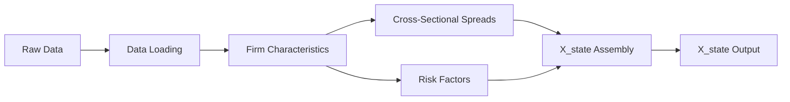

# DGSF Feature Engineering Guide

**Document ID**: FEATURE_ENGINEERING_GUIDE  
**Purpose**: Complete reference for DGSF feature engineering pipeline  
**Audience**: Researchers, ML engineers implementing DGSF models

---

## Table of Contents

1. [Pipeline Overview](#pipeline-overview)
2. [Data Sources](#data-sources)
3. [Firm Characteristics](#firm-characteristics)
4. [Cross-Sectional Spreads](#cross-sectional-spreads)
5. [Risk Factors](#risk-factors)
6. [X_state Assembly](#x_state-assembly)
7. [Usage Examples](#usage-examples)
8. [Troubleshooting FAQ](#troubleshooting-faq)

---

## Pipeline Overview

The DGSF feature engineering pipeline transforms raw financial data into the **X_state** matrix used by the SDF encoder. The pipeline follows a 7-step sequential workflow:



### Pipeline Steps

| Step | Module | Output | Description |
|------|--------|--------|-------------|
| 1 | `data_loaders.py` | 5 DataFrames | Load price, shares, financials, returns, risk-free rate |
| 2-3 | `firm_characteristics.py` | 5 characteristics | Compute size, momentum, profitability, volatility, B/M |
| 4 | `spreads_factors.py` | 5D spreads | Compute tertile-sorted cross-sectional spreads |
| 5 | `spreads_factors.py` | 5 factors | Compute market, SMB, HML, momentum, reversal factors |
| 6 | `spreads_factors.py` | X_state | Assemble characteristics + spreads (+ factors) |
| 7 | `run_feature_engineering.py` | CSV file | Save X_state to disk |

### Key Design Principles

1. **No Look-Ahead Bias**: All features at time `t` use only data available up to `t-1`
2. **Winsorization**: Extreme values capped at [1%, 99%] or [0.5%, 99.5%] percentiles
3. **Forward-Fill**: Missing values filled forward (max 1-3 months depending on feature)
4. **Tertile Sorting**: Cross-sectional spreads use 30/40/30 quantile splits
5. **Market-Cap Weighting**: Portfolio returns weighted by firm size

---

## Data Sources

### 1. Price Data
**File**: `data/raw/price.csv`  
**Schema**: `date, firm_id, price`  
**Frequency**: Daily (aligned to month-end)  
**Usage**: Size calculation (price × shares outstanding)

### 2. Shares Outstanding
**File**: `data/raw/shares.csv`  
**Schema**: `date, firm_id, shares`  
**Frequency**: Monthly  
**Usage**: Market capitalization (size)

### 3. Financial Statements
**File**: `data/raw/financials.csv`  
**Schema**: `date, firm_id, operating_income, total_assets, total_liabilities, stockholders_equity, preferred_stock`  
**Frequency**: Quarterly (forward-filled to monthly)  
**Usage**: Profitability, book-to-market ratio

### 4. Returns
**File**: `data/raw/returns.csv`  
**Schema**: `date, firm_id, return`  
**Frequency**: Monthly  
**Usage**: Momentum, volatility, reversal, factor construction

### 5. Risk-Free Rate
**File**: `data/raw/risk_free.csv`  
**Schema**: `date, rf_rate`  
**Frequency**: Monthly  
**Usage**: Market factor (excess returns)

---

## Firm Characteristics

### 1. Size (log market capitalization)

**Formula**:
```python
size = log(price × shares_outstanding × 1e6)
```

**Properties**:
- Winsorization: [1%, 99%]
- Forward-fill: Max 3 months
- No history requirement

**Interpretation**: Larger firms (higher size) typically have lower expected returns (size premium).

---

### 2. Momentum (cumulative past returns)

**Formula**:
```python
momentum = Σ(returns[t-12:t-2])  # Skip most recent month
```

**Properties**:
- Lookback: 12 months (skip last month to avoid reversal)
- Winsorization: [1%, 99%]
- Forward-fill: Max 1 month
- Min history: 8 months

**Interpretation**: Stocks with high past returns tend to continue outperforming (momentum effect).

---

### 3. Profitability (ROA)

**Formula**:
```python
profitability = operating_income / total_assets
```

**Properties**:
- Winsorization: [0.5%, 99.5%] (stricter to handle outliers)
- Forward-fill: Max 3 months
- Excludes: Firms with book equity ≤ $0

**Interpretation**: More profitable firms (higher ROA) tend to have higher returns.

---

### 4. Volatility (return standard deviation)

**Formula**:
```python
volatility = std(returns[t-6:t-1])  # 6-month rolling window
```

**Properties**:
- Lookback: 6 months
- Winsorization: [1%, 99%]
- Forward-fill: Max 1 month
- Min history: 6 months

**Interpretation**: High-volatility stocks are riskier and may require higher expected returns.

---

### 5. Book-to-Market Ratio

**Formula**:
```python
book_equity = stockholders_equity - preferred_stock
market_cap = price × shares_outstanding
book_to_market = book_equity / market_cap
```

**Properties**:
- Winsorization: [0.5%, 99.5%]
- Forward-fill: Max 3 months
- Excludes: Firms with book equity ≤ $0

**Interpretation**: Value stocks (high B/M) historically outperform growth stocks (low B/M).

---

## Cross-Sectional Spreads

Cross-sectional spreads capture the **high-low spread** within each characteristic at time `t`.

### Computation Method

1. **Tertile Sorting**: Rank firms by characteristic into 3 groups (30%, 40%, 30%)
2. **Portfolio Returns**: Compute value-weighted mean return for each tertile
3. **Spread**: `High_tertile - Low_tertile`

### Formula
```python
spreads[t] = mean(returns[high_30%]) - mean(returns[low_30%])
```

### Weighting Options
- **Equal-weighted**: Simple average (default)
- **Value-weighted**: Weighted by market cap (optional, pass `market_cap` DataFrame)

### Output Dimensions
**5D vector**: `[size_spread, book_to_market_spread, momentum_spread, profitability_spread, volatility_spread]`

---

## Risk Factors

### 1. Market Factor (MKT)

**Formula**:
```python
market_factor[t] = mean(returns[t]) - risk_free_rate[t]
```

**Interpretation**: Excess return of the overall market portfolio.

---

### 2. Size Factor (SMB - Small Minus Big)

**Formula**:
```python
# 2×3 double sorts on size × book-to-market
size_median = median(size[t])
b2m_tertiles = [33%, 67%] percentiles

# 6 portfolios: {Small, Big} × {Low, Medium, High}
SMB[t] = mean([Small-Low, Small-Medium, Small-High]) 
       - mean([Big-Low, Big-Medium, Big-High])
```

**Interpretation**: Return of small-cap stocks minus large-cap stocks (Fama-French factor).

---

### 3. Value Factor (HML - High Minus Low)

**Formula**:
```python
# Same 2×3 double sorts as SMB
HML[t] = mean([Small-High, Big-High]) 
       - mean([Small-Low, Big-Low])
```

**Interpretation**: Return of high B/M (value) stocks minus low B/M (growth) stocks.

---

### 4. Momentum Factor (WML - Winners Minus Losers)

**Formula**:
```python
# Tertile sorts on past 12-month momentum
momentum_tertiles = [33%, 67%] percentiles

WML[t] = mean(returns[high_momentum]) 
       - mean(returns[low_momentum])
```

**Interpretation**: Return of past winners minus past losers.

---

### 5. Reversal Factor (REV)

**Formula**:
```python
# Short-term reversal on 1-month lagged returns
reversal_tertiles = [33%, 67%] percentiles

REV[t] = mean(returns[low_past_1m]) 
       - mean(returns[high_past_1m])
```

**Interpretation**: Short-term reversal effect (contrarian strategy).

---

## X_state Assembly

The final **X_state** matrix concatenates characteristics and spreads (optionally with factors).

### Dimensions

**Without Factors** (10D):
```
X_state[t] = [
    log_size,               # Dimension 0
    book_to_market,         # Dimension 1
    momentum,               # Dimension 2
    profitability,          # Dimension 3
    volatility,             # Dimension 4
    size_spread,            # Dimension 5
    book_to_market_spread,  # Dimension 6
    momentum_spread,        # Dimension 7
    profitability_spread,   # Dimension 8
    volatility_spread       # Dimension 9
]
```

**With Factors** (15D):
```
X_state[t] = [10D characteristics + spreads] + [
    market_factor,          # Dimension 10
    smb_factor,             # Dimension 11
    hml_factor,             # Dimension 12
    momentum_factor,        # Dimension 13
    reversal_factor         # Dimension 14
]
```

### Missing Value Handling

1. **Characteristics**: Forward-fill up to 1-3 months (depends on feature)
2. **Spreads**: May be NaN if insufficient cross-sectional data at time `t`
3. **Factors**: May be NaN if portfolio construction fails (e.g., insufficient firms)

**Note**: Downstream models (e.g., SDF encoder) should handle NaN values (e.g., masking or imputation).

---

## Usage Examples

### 1. Basic Pipeline Execution

```bash
cd projects/dgsf
python scripts/run_feature_engineering.py \
    --config configs/feature_engineering.yaml \
    --output-dir data/processed \
    --start-date 2010-01-01 \
    --end-date 2023-12-31
```

**Output**: `data/processed/X_state_2010-01-01_2023-12-31.csv`

---

### 2. Dry-Run Mode (Verify Without Writing)

```bash
python scripts/run_feature_engineering.py \
    --config configs/feature_engineering.yaml \
    --dry-run
```

**Output**: Console summary of dimensions and date ranges, no file written.

---

### 3. Custom Date Range

```bash
python scripts/run_feature_engineering.py \
    --start-date 2015-01-01 \
    --end-date 2020-12-31
```

---

### 4. Programmatic Usage

```python
from scripts.data_loaders import load_all_data
from scripts.firm_characteristics import compute_all_characteristics
from scripts.spreads_factors import (
    compute_style_spreads,
    compute_market_factor,
    compute_smb_hml,
    compute_momentum_factor,
    compute_reversal,
    assemble_X_state
)

# Step 1: Load data
data = load_all_data(
    price_path='data/raw/price.csv',
    shares_path='data/raw/shares.csv',
    financials_path='data/raw/financials.csv',
    returns_path='data/raw/returns.csv',
    risk_free_path='data/raw/risk_free.csv'
)

# Step 2-3: Compute characteristics
size, momentum, profitability, volatility, book_to_market = \
    compute_all_characteristics(
        price_data=data['price'],
        shares_outstanding=data['shares'],
        financial_statements=data['financials'],
        returns=data['returns']
    )

# Step 4: Compute spreads
spreads = compute_style_spreads(
    size=size,
    book_to_market=book_to_market,
    momentum=momentum,
    profitability=profitability,
    volatility=volatility
)

# Step 5: Compute factors
market_factor = compute_market_factor(data['returns'], data['risk_free'])
smb, hml = compute_smb_hml(size, book_to_market, data['returns'])
momentum_factor = compute_momentum_factor(momentum, data['returns'])
reversal = compute_reversal(data['returns'])

# Step 6: Assemble X_state
characteristics = {
    'size': size,
    'book_to_market': book_to_market,
    'momentum': momentum,
    'profitability': profitability,
    'volatility': volatility
}
factors = {
    'market_factor': market_factor,
    'smb_factor': smb,
    'hml_factor': hml,
    'momentum_factor': momentum_factor,
    'reversal_factor': reversal
}

X_state = assemble_X_state(characteristics, spreads, factors)

# Step 7: Save
X_state.to_csv('data/processed/X_state.csv', index=False)
```

---

## Troubleshooting FAQ

### Q1: Why are there NaN values in X_state?

**Causes**:
1. **Early time periods**: Insufficient lookback history for momentum (12 months) or volatility (6 months)
2. **Quarterly financials**: Profitability/B/M only updated quarterly, forward-filled for intermediate months
3. **Insufficient cross-sectional data**: If < 10 firms have valid characteristic at time `t`, spreads may be NaN

**Solution**: 
- Filter X_state to dates with < 20% NaN ratio
- Use forward-fill or imputation in downstream models
- Extend data history (e.g., start from 2000 instead of 2010)

---

### Q2: How do I handle encoding errors (e.g., UTF-8 checkmark issue)?

**Error**:
```
UnicodeEncodeError: 'gbk' codec can't encode character '\u2713'
```

**Solution**:
- Replace UTF-8 symbols (✓, ✗) with ASCII equivalents ("OK", "[v]", "PASS")
- Or redirect output: `python run_feature_engineering.py > output.log 2>&1`

---

### Q3: Pipeline execution is slow. How to optimize?

**Bottlenecks**:
1. Large cross-sectional sorts (tertile sorting on 1000+ firms)
2. Multiple rolling window calculations (momentum, volatility)

**Optimization**:
- Use vectorized pandas operations (already implemented)
- Parallelize across time periods (future work: multiprocessing)
- Cache intermediate results (characteristics, spreads)

**Benchmark**: 100 firms × 24 months should complete in < 5s (verified in E2E tests).

---

### Q4: How do I validate no data leakage?

**Validation Steps**:
1. **Manual inspection**: Check that `compute_momentum` skips last month (`returns[t-12:t-2]`)
2. **Unit tests**: Run `pytest tests/test_firm_characteristics.py -k "leakage"`
3. **E2E test**: Run `pytest tests/test_feature_pipeline_e2e.py::test_e2e_pipeline_no_data_leakage`

**Expected**: All characteristics at time `t` should use data from `t-1` or earlier.

---

### Q5: What if I have missing returns data?

**Impact**:
- Momentum, volatility, reversal cannot be computed for affected firms
- Factors (SMB, HML, WML, REV) may have reduced cross-sectional coverage

**Solution**:
- **Tolerate**: Pipeline handles missing data gracefully (NaN propagation)
- **Impute**: Fill missing returns with 0 or market average (not recommended)
- **Exclude**: Filter firms with < 80% return coverage before pipeline

---

### Q6: Can I add custom characteristics?

**Yes!** Follow this pattern:

```python
# In firm_characteristics.py
def compute_my_characteristic(data: pd.DataFrame, **kwargs) -> pd.DataFrame:
    """
    Compute custom characteristic.
    
    Args:
        data: Input DataFrame with 'date', 'firm_id', and feature columns
        
    Returns:
        DataFrame with columns ['date', 'firm_id', 'my_characteristic']
    """
    # Your computation logic here
    result = data.copy()
    result['my_characteristic'] = ...
    
    # Apply winsorization
    result = _winsorize_characteristic(result, 'my_characteristic', 
                                        lower=0.01, upper=0.99)
    
    return result[['date', 'firm_id', 'my_characteristic']]
```

Then update `compute_all_characteristics()` to include it.

---

### Q7: How do I interpret spread values?

**Example**: `size_spread[2020-12] = 0.05` (5%)

**Interpretation**: In December 2020, the portfolio of small firms (bottom 30% by size) outperformed the portfolio of large firms (top 30%) by 5% that month.

**Positive spread**: Small firms outperformed (size premium exists)  
**Negative spread**: Large firms outperformed (size premium reversed)  
**Near-zero spread**: No significant cross-sectional dispersion

---

### Q8: What is the difference between factors and spreads?

| Feature | Spreads | Factors |
|---------|---------|---------|
| **Definition** | High-low spread within single characteristic | Portfolio returns from multi-dimensional sorts |
| **Dimensions** | 1D per characteristic | May use 2D sorts (e.g., size × B/M) |
| **Purpose** | Capture cross-sectional dispersion | Replicate academic risk factors |
| **Example** | `size_spread = mean(small) - mean(large)` | `SMB = mean(small portfolios) - mean(large portfolios)` |

**When to use**:
- **Spreads only** (10D X_state): Simpler, less collinearity
- **Spreads + Factors** (15D X_state): Richer feature space, better captures Fama-French effects

---

### Q9: How do I debug a specific date's X_state?

```python
# Load X_state
import pandas as pd
X_state = pd.read_csv('data/processed/X_state.csv')

# Inspect specific date
target_date = pd.Timestamp('2020-12-31')
row = X_state[X_state['date'] == target_date]

print(row.T)  # Transpose for readability
print(f"\nNaN count: {row.isnull().sum().sum()}")
```

---

### Q10: What tests should I run before deploying?

**Minimal validation**:
```bash
# 1. Unit tests (characteristics)
pytest projects/dgsf/tests/test_firm_characteristics.py -v

# 2. Unit tests (spreads + factors)
pytest projects/dgsf/tests/test_spreads_factors.py -v

# 3. E2E pipeline test
pytest projects/dgsf/tests/test_feature_pipeline_e2e.py -v

# 4. Dry-run on real data
python scripts/run_feature_engineering.py --dry-run
```

**Expected**: 66 tests passed (19 + 19 + 7 + E2E execution).

---

## References

1. **Fama-French (1993)**: "Common Risk Factors in the Returns on Stocks and Bonds"
2. **Jegadeesh-Titman (1993)**: "Returns to Buying Winners and Selling Losers"
3. **Gu-Kelly-Xiu (2020)**: "Empirical Asset Pricing via Machine Learning" (DGSF methodology)

---

**Last Updated**: 2026-02-04  
**Version**: 1.0  
**Maintainer**: DGSF Project Team
