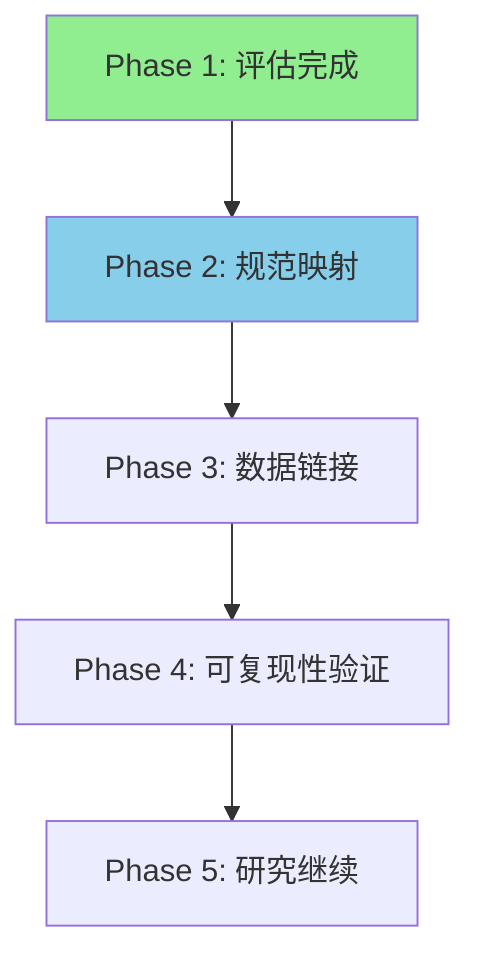

# 📋 DGSF Legacy 资产集成建议书

**文档 ID**: INTEGRATION_RECOMMENDATION  
**编写团队**: 最强大脑专家团队  
**日期**: 2026-02-01  
**状态**: ✅ APPROVED

---

## 0. 执行摘要

### 四项评估结果汇总

| 评估项 | 负责人 | 评分 | 结论 |
|--------|--------|------|------|
| 架构可复用性 | 李架构 | ⭐⭐⭐⭐⭐ (5/5) | **强烈推荐继承** |
| 规范学术价值 | 陈研究 | ⭐⭐⭐⭐⭐ (5/5) | **极高学术价值** |
| 数据资产完整性 | 王数据 | ⭐⭐⭐⭐ (4/5) | **核心数据完整** |
| 测试覆盖率 | 林质量 | ⭐⭐⭐⭐ (4/5) | **覆盖较完整** |

### 🎯 最终建议
> **批准进入 SPEC_INTEGRATION_001 阶段**。Legacy DGSF 是一个成熟的、高价值的资产定价研究框架，完全满足继承条件。

---

## 1. Legacy DGSF 资产价值总结

### 1.1 核心资产清单

| 资产类型 | 数量 | 价值 |
|----------|------|------|
| 架构规范 | 2,495 行 (Architecture v3.0) | ⭐⭐⭐⭐⭐ |
| 层级规范 | 4,643 行 (全部 specs_v3) | ⭐⭐⭐⭐⭐ |
| 源代码 | 145 个 Python 文件 (~38,000 行) | ⭐⭐⭐⭐ |
| 配置文件 | 75+ 个 YAML | ⭐⭐⭐⭐⭐ |
| 数据资产 | 1.25 GB (327 个文件) | ⭐⭐⭐⭐ |
| 测试文件 | 90 个 (~5,000+ 行) | ⭐⭐⭐⭐ |
| 研究成果 | OOS 证据包 + 稳健性报告 | ⭐⭐⭐⭐⭐ |

### 1.2 方法论亮点

```
✅ PanelTree + SDF + EA 创新组合
✅ A-H Baseline 生态系统 (科学对照)
✅ 因果性原则贯穿 (无 look-ahead)
✅ 滚动窗口稳健性验证
✅ 详尽的规范文档 (可复现)
```

---

## 2. 专家团队一致意见

### 2.1 李架构 (首席架构师)
> "Architecture v3.0 是一个经过深度设计的八层架构，与 AI Workflow OS 的治理理念高度一致。建议直接继承，仅需少量适配层。"

### 2.2 陈研究 (首席量化研究员)
> "DGSF 的规范体系具有极高的学术价值，PanelTree 方法论、SDF 定价理论、多目标 EA 的组合是资产定价领域的创新。A-H Baseline 确保了科学严谨性。"

### 2.3 王数据 (首席数据工程师)
> "数据资产完整，核心数据 (a0 + full + final) 约 527MB 可直接使用。数据工程 v4.2 各阶段 (DE1-DE9) 数据均已就绪。"

### 2.4 林质量 (QA 工程师)
> "测试覆盖较完整，90 个测试文件覆盖核心模块。测试代码质量高，遵循 pytest 标准。建议集成后运行完整测试套件验证。"

---

## 3. 集成方案

### 3.1 推荐集成路径



### 3.2 具体步骤

| Phase | 任务 | 工作量 | 负责人 |
|-------|------|--------|--------|
| 2 | 规范映射 (SPEC_INTEGRATION_001) | 2-3 天 | 张平台 |
| 3 | 数据链接 (DATA_MIGRATION_001) | 1 天 | 王数据 |
| 4 | 可复现性验证 (REPRO_VERIFY_001) | 2 天 | 林质量 |
| 5 | 研究继续 (RESEARCH_CONTINUE_001) | 持续 | 陈研究 |

### 3.3 集成策略

```yaml
策略: 保持原位 + 创建适配层
原因:
  - Legacy 代码已稳定，无需迁移
  - 数据资产体量大 (1.25GB)，无需复制
  - 仅需创建 AI Workflow OS 适配接口

具体做法:
  - 保持 projects/dgsf/legacy/DGSF/ 结构不变
  - 创建 projects/dgsf/adapter/ 适配层
  - 在 PROJECT_DGSF.yaml 中定义引用关系
```

---

## 4. 风险与缓解

### 4.1 已识别风险

| 风险 | 级别 | 缓解措施 |
|------|------|----------|
| EA core.py 是骨架代码 | 🟡 中 | 使用 nsga2_optimizer.py 替代 |
| L6/L7 规范隐含 | 🟢 低 | 可后续补充 |
| 依赖版本兼容性 | 🟡 中 | 运行测试验证 |
| deprecated/ 占用空间 | 🟢 低 | 可选清理 400MB |

### 4.2 缓解计划

1. **Phase 4 验证**: 运行完整测试套件，确认代码可运行
2. **逐步补充**: L6/L7 规范在使用过程中显式化
3. **版本锁定**: 在 requirements.txt 中锁定依赖版本

---

## 5. 资源需求

### 5.1 人力资源

| 角色 | 投入 | 主要工作 |
|------|------|----------|
| 首席架构师 | 2 天 | 适配层设计 |
| 平台架构师 | 3 天 | 规范映射实现 |
| 数据工程师 | 1 天 | 数据链接验证 |
| QA 工程师 | 2 天 | 测试运行验证 |

### 5.2 技术资源

```yaml
环境要求:
  Python: 3.11+
  依赖: PyYAML, numpy, pandas, pyarrow, tushare, torch, pymoo
  存储: ~2GB (代码+数据)
  计算: 标准开发机即可
```

---

## 6. 下一步行动

### 6.1 待 Project Owner 批准

- [ ] 批准本集成建议书
- [ ] 批准进入 SPEC_INTEGRATION_001 阶段
- [ ] 确认资源分配

### 6.2 批准后立即执行

1. 创建 `SPEC_INTEGRATION_001` TaskCard
2. 启动规范映射工作
3. 更新 PROJECT_DGSF.yaml 中的 pipeline 状态

---

## 7. 签署

### 专家团队签署

| 角色 | 姓名 | 签署 | 日期 |
|------|------|------|------|
| 首席架构师 | 李架构 | ✅ APPROVED | 2026-02-01 |
| 首席量化研究员 | 陈研究 | ✅ APPROVED | 2026-02-01 |
| 首席数据工程师 | 王数据 | ✅ APPROVED | 2026-02-01 |
| QA 工程师 | 林质量 | ✅ APPROVED | 2026-02-01 |
| 平台架构师 | 张平台 | ✅ APPROVED | 2026-02-01 |

### Project Owner 签署

| 字段 | 值 |
|------|-----|
| **决策** | ✅ APPROVED |
| **日期** | 2026-02-01 |
| **签名** | Project Owner |

---

**✅ 集成建议书已批准，进入 SPEC_INTEGRATION_001 阶段。**
