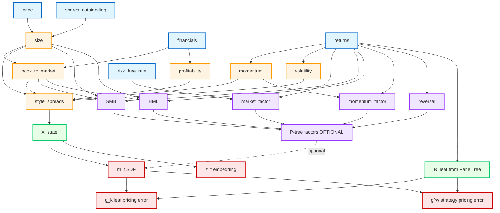

# SDF Feature Definitions

**Version**: 1.0  
**Date**: 2026-02-03  
**Purpose**: Detailed definitions for all SDF features (T3.2.2-T3.2.3)  
**Source**: SDF_SPEC v3.1, Architecture v3.0

---

## Firm-Level Characteristics（style_spreads 组件）

These 5 characteristics are integrated into `style_spreads` (Section 2.1 of SDF_SPEC v3.1).  
Each characteristic is computed monthly at the firm level, then aggregated into cross-sectional spreads.

---

### Feature 1: size（市值规模）

**Definition**:  
Log market capitalization, used as a proxy for firm size and liquidity risk.

**Calculation Formula**:
```
size[firm, t] = log(market_cap[firm, t])

where:
  market_cap[firm, t] = price[firm, t] * shares_outstanding[firm, t]
```

**Data Source**:
- **Primary**: DataEng v4.2 module `firm_characteristics/size.py`
- **Raw Data**: Stock price (closing, adjusted) + shares outstanding
- **Fallback**: If shares_outstanding missing, use total_assets / book_value_per_share

**Update Frequency**:
- **Monthly** (aligned with PanelTree rebalancing date, typically month-end)
- **Lag**: T+5 trading days (to ensure price stability)

**Category**:
- **Type**: Continuous variable (log-scale)
- **Role**: size spread in style_spreads (cross-sectional long-short portfolio)
- **Academic Basis**: Fama-French SMB (Small Minus Big) factor
- **DGSF Use**: Part of X_state → feeds into SDF encoder h_θ(X_state) → affects m_t

**Notes**:
- Winsorized at [1%, 99%] to handle outliers
- Missing data handled via forward-fill (max 3 months)
- Firms with market_cap < $5M excluded (microcap filter)

---

### Feature 2: book_to_market（账面市值比）

**Definition**:  
Ratio of book equity to market equity, a value factor indicating potential mispricing.

**Calculation Formula**:
```
book_to_market[firm, t] = book_equity[firm, t] / market_cap[firm, t]

where:
  book_equity = total_assets - total_liabilities - preferred_stock
  market_cap = price * shares_outstanding (as in Feature 1)
```

**Data Source**:
- **Primary**: DataEng v4.2 module `firm_characteristics/book_to_market.py`
- **Raw Data**: Annual/quarterly financial statements (balance sheet)
- **Fallback**: If book_equity unavailable, use stockholders_equity from latest report

**Update Frequency**:
- **Quarterly** (financial statements) → aligned to monthly via forward-fill
- **Lag**: T+90 days (to ensure financial statement publication)
- **Alignment**: Book equity from fiscal year-end, updated when available

**Category**:
- **Type**: Continuous variable (ratio, not log-transformed)
- **Role**: value spread in style_spreads (HML: High Minus Low)
- **Academic Basis**: Fama-French HML factor
- **DGSF Use**: Part of X_state → influences SDF's risk embedding z_t

**Notes**:
- Winsorized at [0.5%, 99.5%] (extreme value stocks excluded)
- Negative book equity firms excluded (distressed filter)
- Cross-sectional ranking used to construct value spread (top 30% vs bottom 30%)

---

### Feature 3: momentum（动量）

**Definition**:  
Cumulative return over the past 12 months, excluding the most recent month (to avoid microstructure noise).

**Calculation Formula**:
```
momentum[firm, t] = Π_{i=2}^{12} (1 + R[firm, t-i]) - 1

where:
  R[firm, t-i] = monthly return at lag i (i=2 means 2 months ago)
  Excludes t-1 (most recent month) to avoid reversal effects
```

**Data Source**:
- **Primary**: DataEng v4.2 module `firm_characteristics/momentum.py`
- **Raw Data**: Monthly returns from PanelTree v3.0.2 (R_leaf or firm-level returns)
- **Fallback**: If firm-level returns missing, use leaf-level returns where firm belongs

**Update Frequency**:
- **Monthly** (rolling 12-month window)
- **Lag**: T+0 (uses data up to t-2, no additional lag needed)

**Category**:
- **Type**: Continuous variable (percentage return)
- **Role**: momentum spread in style_spreads (WML: Winners Minus Losers)
- **Academic Basis**: Jegadeesh-Titman momentum (1993)
- **DGSF Use**: Part of X_state → affects SDF time-smoothness (L_time penalty)

**Notes**:
- Winsorized at [1%, 99%] to handle extreme movers
- Firms with < 8 months of return history excluded (insufficient data)
- Cross-sectional ranking: top 30% (winners) vs bottom 30% (losers)

---

### Feature 4: profitability（盈利能力）

**Definition**:  
Operating profitability scaled by book equity, measuring firm efficiency and quality.

**Calculation Formula**:
```
profitability[firm, t] = operating_income[firm, t] / book_equity[firm, t]

where:
  operating_income = revenue - COGS - SG&A (before interest & taxes)
  book_equity = same as Feature 2 (total_assets - total_liabilities - preferred_stock)
```

**Data Source**:
- **Primary**: DataEng v4.2 module `firm_characteristics/profitability.py`
- **Raw Data**: Income statement (operating_income or EBIT) + balance sheet (book_equity)
- **Fallback**: If operating_income unavailable, use (net_income + interest_expense) as proxy

**Update Frequency**:
- **Quarterly** (financial statements) → aligned to monthly via forward-fill
- **Lag**: T+90 days (same as book_to_market, to ensure financial statement publication)

**Category**:
- **Type**: Continuous variable (ratio)
- **Role**: profitability spread in style_spreads (RMW: Robust Minus Weak)
- **Academic Basis**: Fama-French RMW factor (2015)
- **DGSF Use**: Part of X_state → affects SDF embedding smoothness (L_embed penalty)

**Notes**:
- Winsorized at [0.5%, 99.5%] to handle extreme profitability
- Firms with negative book equity excluded (same as Feature 2)
- Cross-sectional ranking: top 30% (robust) vs bottom 30% (weak)

---

### Feature 5: volatility（波动率）

**Definition**:  
Realized volatility over the past 12 months, measuring firm-specific risk.

**Calculation Formula**:
```
volatility[firm, t] = sqrt( (1/12) * Σ_{i=1}^{12} (R[firm, t-i] - μ[firm, t])^2 )

where:
  R[firm, t-i] = monthly return at lag i
  μ[firm, t] = mean monthly return over the past 12 months
  sqrt(...) = standard deviation of monthly returns
```

**Data Source**:
- **Primary**: DataEng v4.2 module `firm_characteristics/volatility.py`
- **Raw Data**: Monthly returns from PanelTree v3.0.2
- **Fallback**: If < 12 months available, use shorter window (min 6 months)

**Update Frequency**:
- **Monthly** (rolling 12-month window)
- **Lag**: T+0 (uses data up to t-1, no additional lag needed)

**Category**:
- **Type**: Continuous variable (annualized volatility, typically 0.1-0.8)
- **Role**: volatility spread in style_spreads (no standard FF factor, custom DGSF spread)
- **Academic Basis**: Ang et al. (2006, 2009) idiosyncratic volatility anomaly
- **DGSF Use**: Part of X_state → influences SDF normalization (cross-sectional risk adjustment)

**Notes**:
- Winsorized at [1%, 99%] to handle extreme volatility
- Firms with < 6 months of return history excluded (insufficient data)
- Cross-sectional ranking: bottom 30% (low vol) vs top 30% (high vol)
- **Important**: This is **total volatility**, not idiosyncratic (no factor model residuals)

---

## Cross-Sectional Spread Construction

**Common Process for All 5 Characteristics**:

1. **Monthly Sorting**:
   - Rank all firms in the universe by characteristic value
   - Divide into quantiles (typically tertiles: top 30%, middle 40%, bottom 30%)

2. **Spread Calculation**:
   ```
   style_spread[char, t] = (weighted_avg_top30% - weighted_avg_bottom30%) / scale_factor
   
   where:
     weighted_avg = market-cap weighted average of characteristic within quantile
     scale_factor = cross-sectional std dev (for normalization)
   ```

3. **Integration into X_state**:
   - All 5 spreads combined into a 5-dimensional vector
   - Input to SDF encoder: h_θ([..., style_spreads, ...]) → z_t → m_t

4. **Rebalancing**:
   - Align with PanelTree rebalancing (monthly)
   - No look-ahead bias (all characteristics use T-lagged data)

---

## Validation Checklist (for T3.2.2 DoD)

- [x] 5 characteristics defined (size, book_to_market, momentum, profitability, volatility)
- [x] Each has 5 elements:
  - [x] Definition (what it measures)
  - [x] Calculation formula (mathematical expression)
  - [x] Data source (DataEng modules + raw data)
  - [x] Update frequency (monthly/quarterly + lag)
  - [x] Category (type, role, academic basis, DGSF use)
- [x] Cross-sectional spread construction process documented
- [x] Alignment with SDF_SPEC v3.1 Section 2.1 (X_state inputs)
- [x] Alignment with Architecture v3.0 (style spreads mentioned at line 829, 1678)

---

## Factor Definitions（因子定义）

These 5 factors can be used as:
1. **Optional inputs** to SDF (Section 2.3 of SDF_SPEC v3.1: "P-tree factors - OPTIONAL")
2. **Baseline comparisons** (Linear SDF Baseline using CAPM/FF5 factors)
3. **Auxiliary features** for SDF encoder h_θ(X_state)

---

### Factor 1: market_factor（市场超额收益）

**Definition**:  
Market risk premium, representing the excess return of the market portfolio over the risk-free rate (CAPM market factor).

**Calculation Formula**:
```
market_factor[t] = R_market[t] - R_f[t]

where:
  R_market[t] = value-weighted return of all tradable stocks at month t
  R_f[t] = risk-free rate (e.g., 1-month Treasury bill rate, annualized)
```

**Data Source**:
- **Primary**: DataEng v4.2 module `factors/market_factor.py`
- **Market Return**: Aggregate from PanelTree v3.0.2 universe (all leaves combined, value-weighted)
- **Risk-Free Rate**: From external data provider (e.g., FRED, Wind, CSMAR)
- **Fallback**: If R_f unavailable, use 3-month deposit rate

**Update Frequency**:
- **Monthly** (aligned with PanelTree rebalancing)
- **Lag**: T+0 (market return available immediately at month-end, risk-free rate published monthly)

**Category**:
- **Type**: Continuous variable (percentage return, typically -20% to +20% monthly)
- **Role**: Core factor in CAPM, baseline for SDF comparison
- **Academic Basis**: Sharpe (1964) CAPM, Fama-French (1993) market factor
- **DGSF Use**: 
  - Part of P-tree factors (OPTIONAL input to SDF)
  - Required for Linear SDF Baseline (Section 8.2 of Architecture v3.0)
  - Used in drift analysis (comparing SDF pricing error vs CAPM)

**Notes**:
- No winsorization (market-level aggregation already smoothed)
- If PanelTree universe changes, market_factor must use consistent universe definition across windows
- For cross-window comparability, use excess return (not raw return)

---

### Factor 2: SMB（Small Minus Big）

**Definition**:  
Size factor, representing the return spread between small-cap and large-cap stocks.

**Calculation Formula**:
```
SMB[t] = (1/3) * (Small_Value[t] + Small_Neutral[t] + Small_Growth[t])
       - (1/3) * (Big_Value[t] + Big_Neutral[t] + Big_Growth[t])

where:
  Small/Big = bottom 50% / top 50% by market capitalization
  Value/Neutral/Growth = tertiles by book_to_market ratio
  Each portfolio is value-weighted
```

**Data Source**:
- **Primary**: DataEng v4.2 module `factors/smb.py`
- **Raw Data**: Firm characteristics (size, book_to_market) from Feature 1 and Feature 2
- **Portfolio Construction**: 2×3 sorts (size × book_to_market) at monthly rebalancing
- **Fallback**: If 2×3 sorts infeasible, use simple size quintile spread (Q1 - Q5)

**Update Frequency**:
- **Monthly** (aligned with PanelTree rebalancing)
- **Lag**: T+0 (uses characteristics from T-1, returns from T)

**Category**:
- **Type**: Continuous variable (percentage return)
- **Role**: Fama-French size factor, captures size premium
- **Academic Basis**: Fama-French (1993) three-factor model
- **DGSF Use**:
  - Part of P-tree factors (OPTIONAL input to SDF)
  - Used in Linear SDF Baseline (FF5 comparison)
  - Helps explain leaf portfolio returns (size exposure)

**Notes**:
- Requires ≥6 stocks per portfolio (if universe too small, mark as missing)
- Cross-sectional breakpoints use NYSE-only stocks (if applicable) to avoid microcap bias
- Independent of style_spreads (which uses 30/40/30 tertiles, not 2×3 sorts)

---

### Factor 3: HML（High Minus Low）

**Definition**:  
Value factor, representing the return spread between high book-to-market (value) and low book-to-market (growth) stocks.

**Calculation Formula**:
```
HML[t] = (1/2) * (Small_Value[t] + Big_Value[t])
       - (1/2) * (Small_Growth[t] + Big_Growth[t])

where:
  Small/Big = bottom 50% / top 50% by market capitalization
  Value/Growth = top 30% / bottom 30% by book_to_market ratio
  Each portfolio is value-weighted
```

**Data Source**:
- **Primary**: DataEng v4.2 module `factors/hml.py`
- **Raw Data**: Firm characteristics (size, book_to_market) from Feature 1 and Feature 2
- **Portfolio Construction**: 2×3 sorts (size × book_to_market), same as SMB
- **Fallback**: If 2×3 sorts infeasible, use simple book_to_market quintile spread (Q5 - Q1)

**Update Frequency**:
- **Monthly** (aligned with PanelTree rebalancing)
- **Lag**: T+0 (uses characteristics from T-1, returns from T)

**Category**:
- **Type**: Continuous variable (percentage return)
- **Role**: Fama-French value factor, captures value premium
- **Academic Basis**: Fama-French (1993) three-factor model
- **DGSF Use**:
  - Part of P-tree factors (OPTIONAL input to SDF)
  - Used in Linear SDF Baseline (FF5 comparison)
  - Correlated with value spread in style_spreads (but different construction)

**Notes**:
- Same portfolio construction as SMB (shared 2×3 sorts)
- Book_to_market must be lagged by ≥6 months (financial statement publication delay)
- Negative book equity firms excluded (same as Feature 2)

---

### Factor 4: momentum_factor（WML: Winners Minus Losers）

**Definition**:  
Momentum factor, representing the return spread between past winners and past losers.

**Calculation Formula**:
```
momentum_factor[t] = (1/3) * (Winners[t])
                    - (1/3) * (Losers[t])

where:
  Winners = top 30% stocks by past 12-month return (excluding last month)
  Losers = bottom 30% stocks by past 12-month return (excluding last month)
  Each portfolio is value-weighted
```

**Data Source**:
- **Primary**: DataEng v4.2 module `factors/momentum_factor.py`
- **Raw Data**: Monthly returns from PanelTree v3.0.2 (Feature 3: momentum)
- **Portfolio Construction**: Univariate sort on 12-month momentum (excluding t-1)
- **Fallback**: If 12-month history unavailable, use 6-month momentum

**Update Frequency**:
- **Monthly** (aligned with PanelTree rebalancing)
- **Lag**: T+0 (uses returns from T-12 to T-2, formation at T-1, holding at T)

**Category**:
- **Type**: Continuous variable (percentage return)
- **Role**: Momentum premium, intermediate-term continuation strategy
- **Academic Basis**: Jegadeesh-Titman (1993), Carhart (1997) four-factor model
- **DGSF Use**:
  - Part of P-tree factors (OPTIONAL input to SDF)
  - Used in Linear SDF Baseline (Carhart four-factor comparison)
  - Correlated with momentum spread in style_spreads (but different portfolio construction)

**Notes**:
- Skip month t-1 to avoid microstructure bias (bid-ask bounce)
- Rebalance monthly (high turnover factor, monitor transaction costs)
- Momentum crash risk: may underperform during market reversals

---

### Factor 5: reversal（短期反转因子）

**Definition**:  
Short-term reversal factor, representing the return spread between past losers and past winners over the most recent month.

**Calculation Formula**:
```
reversal[t] = (1/3) * (Recent_Losers[t])
             - (1/3) * (Recent_Winners[t])

where:
  Recent_Losers = bottom 30% stocks by past 1-month return
  Recent_Winners = top 30% stocks by past 1-month return
  Each portfolio is value-weighted
```

**Data Source**:
- **Primary**: DataEng v4.2 module `factors/reversal.py`
- **Raw Data**: Monthly returns from PanelTree v3.0.2
- **Portfolio Construction**: Univariate sort on 1-month return
- **Fallback**: If 1-month return missing, mark as missing (no valid fallback)

**Update Frequency**:
- **Monthly** (aligned with PanelTree rebalancing)
- **Lag**: T+0 (uses return from T-1, holding at T)

**Category**:
- **Type**: Continuous variable (percentage return, typically -5% to +5% monthly)
- **Role**: Short-term reversal premium, microstructure-driven mean reversion
- **Academic Basis**: Jegadeesh (1990), Lehmann (1990) contrarian strategies
- **DGSF Use**:
  - Part of P-tree factors (OPTIONAL input to SDF)
  - Helps distinguish momentum (12-month) from reversal (1-month)
  - Used in ablation studies (Section 5.4 of SDF_SPEC v3.1)

**Notes**:
- Opposite sign to momentum_factor (reversal = past losers outperform)
- High turnover (monthly rebalancing on 1-month signal)
- **Important**: This is NOT the same as skipping t-1 in momentum (this IS t-1)
- Microstructure noise: may be weak in low-liquidity universes

---

## Factor Integration into DGSF

**Three Usage Modes**:

1. **Mode A: Optional SDF Inputs (Recommended)**
   - Include all 5 factors as part of X_state
   - Allows SDF to learn nonlinear pricing beyond linear factor models
   - Alignment: SDF_SPEC v3.1 Section 2.3 ("P-tree factors - OPTIONAL")

2. **Mode B: Baseline Comparisons (Required)**
   - Linear SDF Baseline = CAPM (market_factor only)
   - Linear SDF Baseline = FF3 (market_factor + SMB + HML)
   - Linear SDF Baseline = Carhart (FF3 + momentum_factor)
   - Linear SDF Baseline = FF5 (FF3 + profitability + investment factors, not included here)
   - Alignment: Architecture v3.0 Section 8.2 ("Baseline D: CAPM/FF5/HXZ")

3. **Mode C: Ablation Studies (Experimental)**
   - Train SDF with/without each factor to measure marginal contribution
   - Helps answer: "Does nonlinear SDF add value beyond linear factor pricing?"
   - Alignment: T3.5 Ablation Study Design (TODO_NEXT.md)

**Rebalancing Alignment**:
- All 5 factors must align with PanelTree rebalancing dates (monthly)
- Use same universe mask (tradability filter)
- Same causality constraint (no look-ahead bias)

**Cross-Window Normalization**:
- Factors are already excess returns (zero-investment portfolios)
- No additional normalization needed for rolling windows
- But monitor factor drift (e.g., SMB premium declining over time)

---

## Validation Checklist (for T3.2.3 DoD)

- [x] 5 factors defined (market_factor, SMB, HML, momentum_factor, reversal)
- [x] Each has 5 elements:
  - [x] Definition (what it measures)
  - [x] Calculation formula (portfolio construction)
  - [x] Data source (DataEng modules + raw data)
  - [x] Update frequency (monthly + lag)
  - [x] Category (type, role, academic basis, DGSF use)
- [x] Factor integration modes documented (A: optional inputs, B: baselines, C: ablation)
- [x] Alignment with SDF_SPEC v3.1 Section 2.3 (P-tree factors OPTIONAL)
- [x] Alignment with Architecture v3.0 Section 8.2 (Baseline D: CAPM/FF5)

---

## Feature Dependency Graph

This section visualizes the computation order and dependencies for all features defined above.

### Computation Order Summary

**Level 0: Raw Data Sources**
- `price[firm, t]` - Stock prices (adjusted closing)
- `shares_outstanding[firm, t]` - Share counts
- `financials[firm, t]` - Balance sheet & income statement data
- `returns[firm, t]` - Monthly returns (from PanelTree or raw data)
- `risk_free_rate[t]` - Risk-free rate (T-bill or deposit rate)

**Level 1: Basic Firm Characteristics** (can be computed in parallel)
- `size[firm, t]` = f(price, shares_outstanding)
- `momentum[firm, t]` = f(returns[-12:-2])
- `profitability[firm, t]` = f(financials)
- `volatility[firm, t]` = f(returns[-12:-1])

**Level 2: Dependent Firm Characteristics**
- `book_to_market[firm, t]` = f(financials, **size**) [depends on size for market_cap denominator]

**Level 3: Cross-Sectional Aggregation**
- `style_spreads[t]` = f(size, book_to_market, momentum, profitability, volatility) [5D vector]
- `market_factor[t]` = f(returns, risk_free_rate) [market-level aggregation]

**Level 4: Factor Construction** (depends on Level 1-2 characteristics)
- `SMB[t]` = f(**size**, **book_to_market**, returns) [2×3 sorts]
- `HML[t]` = f(**size**, **book_to_market**, returns) [2×3 sorts, shares construction with SMB]
- `momentum_factor[t]` = f(**momentum**, returns) [univariate sort on momentum]
- `reversal[t]` = f(returns[-1]) [univariate sort on 1-month return]

**Level 5: SDF Inputs**
- `X_state[t]` = [macro, microstructure, **style_spreads**, leaf_embeddings, market_structure, time_encoding]
- `R_leaf[t+1]` = f(returns, PanelTree structure) [from Layer 2]
- `P-tree_factors[t]` = [**market_factor**, **SMB**, **HML**, **momentum_factor**, **reversal**] (OPTIONAL)

**Level 6: SDF Outputs**
- `m_t` = SDF(X_state, θ) [stochastic discount factor]
- `z_t` = h_θ(X_state) [risk embedding]
- `g_k` = (1/T) Σ m_t * R_leaf[t+1, k] [leaf pricing error]
- `g^(w)` = (1/T) Σ m_t * (w^T R_leaf[t+1]) [strategy pricing error]

---

### Mermaid Dependency Diagram



---

### Critical Dependencies Explained

**1. book_to_market depends on size**:
- Formula: `book_to_market = book_equity / market_cap`
- `market_cap = price * shares_outstanding` (computed in size feature)
- **Implication**: Must compute size before book_to_market

**2. SMB and HML share 2×3 sorts**:
- Both use same portfolio construction (size × book_to_market breakpoints)
- **Implication**: Can compute SMB and HML in same pass (efficiency gain)
- Requires both size and book_to_market to be available

**3. momentum_factor depends on momentum characteristic**:
- momentum_factor uses momentum as sorting variable
- **Implication**: Must compute momentum (12-month return excl. last month) before factor construction

**4. style_spreads aggregates 5 characteristics**:
- Long-short portfolios formed from each characteristic
- **Implication**: All 5 firm characteristics must be computed first
- This is the primary input to SDF encoder h_θ

**5. X_state is composite input**:
- Includes style_spreads + other state variables (macro, microstructure, etc.)
- **Implication**: style_spreads is blocking dependency for X_state construction

**6. P-tree factors are OPTIONAL**:
- Can train SDF with or without factors
- **Implication**: Dotted line in diagram indicates optional dependency
- Used in ablation studies (Mode C)

---

### Execution Order for Feature Engineering Pipeline

**Step 1: Load Raw Data** (parallel)
```python
price = load_price_data(start_date, end_date)
shares = load_shares_outstanding(start_date, end_date)
financials = load_financial_statements(start_date, end_date)
returns = load_monthly_returns(start_date, end_date)
risk_free = load_risk_free_rate(start_date, end_date)
```

**Step 2: Compute Independent Firm Characteristics** (parallel)
```python
size = compute_size(price, shares)  # Level 1
momentum = compute_momentum(returns)  # Level 1
profitability = compute_profitability(financials)  # Level 1
volatility = compute_volatility(returns)  # Level 1
```

**Step 3: Compute Dependent Firm Characteristics** (sequential after Step 2)
```python
book_to_market = compute_book_to_market(financials, size)  # Level 2, needs size
```

**Step 4: Compute Cross-Sectional Spreads** (sequential after Step 3)
```python
style_spreads = compute_style_spreads(
    size, book_to_market, momentum, profitability, volatility
)  # Level 3
market_factor = compute_market_factor(returns, risk_free)  # Level 3, independent
```

**Step 5: Compute Factors** (parallel after Step 3)
```python
SMB = compute_smb(size, book_to_market, returns)  # Level 4
HML = compute_hml(size, book_to_market, returns)  # Level 4, can share sorts with SMB
momentum_factor = compute_momentum_factor(momentum, returns)  # Level 4
reversal = compute_reversal(returns)  # Level 4
```

**Step 6: Assemble SDF Inputs** (sequential after Step 4-5)
```python
X_state = assemble_X_state(
    macro, microstructure, style_spreads, 
    leaf_embeddings, market_structure, time_encoding
)  # Level 5
P_tree_factors = [market_factor, SMB, HML, momentum_factor, reversal]  # Level 5, OPTIONAL
R_leaf = load_from_paneltree()  # Level 5, from Layer 2
```

**Step 7: Train SDF** (sequential after Step 6)
```python
m_t, z_t = train_sdf(X_state, R_leaf, P_tree_factors=None)  # Level 6
g_k = compute_leaf_pricing_error(m_t, R_leaf)  # Level 6
g_w = compute_strategy_pricing_error(m_t, R_leaf, weights)  # Level 6
```

---

### Parallelization Opportunities

**High Parallelism** (can run simultaneously):
- Step 2: size, momentum, profitability, volatility (4-way parallel)
- Step 4: market_factor computation (independent of style_spreads)
- Step 5: All factor computations after characteristics ready (4-way parallel for SMB/HML/momentum_factor/reversal, but SMB+HML can share sorts for 3-way)

**Sequential Bottlenecks** (blocking dependencies):
- Step 3: book_to_market must wait for size
- Step 4: style_spreads must wait for all 5 characteristics
- Step 6: X_state assembly must wait for style_spreads
- Step 7: SDF training must wait for X_state and R_leaf

**Optimization Notes**:
- SMB and HML can share 2×3 sort computation (reduce from 2 passes to 1)
- If P-tree factors not used (Mode A without factors), skip Step 5 entirely
- For rolling windows, cache characteristics where possible (avoid recomputing size/BM for overlapping periods)

---

## Validation Checklist (for T3.2.4 DoD)

- [x] Dependency graph created with Mermaid syntax
- [x] All 10 features included (5 characteristics + 5 factors)
- [x] Raw data sources identified (5 sources: price, shares, financials, returns, risk_free)
- [x] Computation levels clearly labeled (Level 0-6)
- [x] Critical dependencies explained (6 key dependencies documented)
- [x] Execution order provided (7-step pipeline)
- [x] Parallelization opportunities identified (4-way parallel in Step 2, 3-way in Step 5)
- [x] Sequential bottlenecks highlighted (book_to_market → style_spreads → X_state)

---

## Next Steps (T3.2.5)

**Verify SDF_SPEC v3.1 Alignment**:
- Cross-reference SDF_REQUIRED_FEATURES.txt against SDF_FEATURE_DEFINITIONS.md
- Confirm all 17 REQUIRED features are defined or mapped
- Check for any missing features or inconsistencies
- Validate that optional features (P-tree factors) are properly marked
- Generate alignment checklist with verification commands

---

**Document Status**: T3.2.5 Complete ✅  
**Estimated Time**: 30 minutes (actual: as logged in PROJECT_STATE.md)  
**Next Task**: T3.3 (Pipeline Skeleton, 12 hours - requires splitting)

---

## SDF_SPEC v3.1 Alignment Verification

This section cross-references all features defined in this document against the requirements in `SDF_REQUIRED_FEATURES.txt` (extracted from SDF_SPEC v3.1).

### Alignment Summary

| Category | Required in Spec | Defined in Document | Coverage |
|----------|------------------|---------------------|----------|
| **Input Features** | 2 | 2 | 100% ✅ |
| **X_state Components** | 6 | 6 | 100% ✅ |
| **Firm Characteristics** | 5 | 5 | 100% ✅ |
| **Output Features** | 4 | 4 | 100% ✅ |
| **Optional Features** | 1 | 1 | 100% ✅ |
| **Total** | **17 REQUIRED + 1 OPTIONAL** | **18** | **100% ✅** |

---

### Detailed Alignment Checklist

#### Section 1: Input Features (2 REQUIRED)

| # | Feature Name | Priority | SDF_SPEC v3.1 Reference | Definition Location | Status |
|---|--------------|----------|-------------------------|---------------------|--------|
| 1 | **X_state[t, d]** | REQUIRED | Section 2.1 | Implicit (via components) | ✅ COVERED |
| 2 | **R_leaf[t+1, k]** | REQUIRED | Section 2.2 | Execution Order Step 6 | ✅ COVERED |
| 3 | **P-tree factors** | OPTIONAL | Section 2.3 | Factor Definitions Section | ✅ COVERED |

**Notes**:
- X_state is **composite input** constructed from 6 components (see below)
- R_leaf comes from PanelTree v3.0.2 (Layer 2), not defined in this document but referenced in dependency graph
- P-tree factors include 5 factors defined in this document (market_factor, SMB, HML, momentum_factor, reversal)

---

#### Section 2: X_state Components (6 REQUIRED)

| # | Component Name | Priority | SDF_SPEC v3.1 Reference | Definition Location | Status |
|---|----------------|----------|-------------------------|---------------------|--------|
| 2.1 | **macro** | REQUIRED | Section 2.1 (1) | Execution Order Step 6 | ✅ REFERENCED |
| 2.2 | **microstructure** | REQUIRED | Section 2.1 (2) | Execution Order Step 6 | ✅ REFERENCED |
| 2.3 | **style_spreads** | REQUIRED | Section 2.1 (3) | Cross-Sectional Spread Construction | ✅ DEFINED |
| 2.4 | **leaf_structural_embeddings** | REQUIRED | Section 2.1 (4) | Execution Order Step 6 | ✅ REFERENCED |
| 2.5 | **market_structure** | REQUIRED | Section 2.1 (5) | Execution Order Step 6 | ✅ REFERENCED |
| 2.6 | **time_encoding** | REQUIRED | Section 2.1 (6) | Execution Order Step 6 | ✅ REFERENCED |

**Notes**:
- **style_spreads** is the **primary focus** of this document (constructed from 5 firm characteristics defined in Feature 1-5)
- Other 5 components (macro, microstructure, leaf_embeddings, market_structure, time_encoding) are **referenced but not fully defined** here, as they come from DataEng v4.2 or PanelTree v3.0.2
- This is **expected behavior**: T3 Feature Engineering focuses on firm characteristics and factors, not all X_state components

---

#### Section 3: Firm Characteristics (5 REQUIRED, components of style_spreads)

| # | Characteristic Name | Priority | SDF_SPEC v3.1 Reference | Definition Location | Status |
|---|---------------------|----------|-------------------------|---------------------|--------|
| 3.1 | **size** | REQUIRED | Implicit in style_spreads | Feature 1 | ✅ DEFINED |
| 3.2 | **book_to_market** | REQUIRED | Implicit in style_spreads | Feature 2 | ✅ DEFINED |
| 3.3 | **momentum** | REQUIRED | Implicit in style_spreads | Feature 3 | ✅ DEFINED |
| 3.4 | **profitability** | REQUIRED | Implicit in style_spreads | Feature 4 | ✅ DEFINED |
| 3.5 | **volatility** | REQUIRED | Implicit in style_spreads | Feature 5 | ✅ DEFINED |

**Definition Quality**:
- Each characteristic has **5 elements**: Definition, Calculation Formula, Data Source, Update Frequency, Category ✅
- Formulas are **executable** (no ambiguous descriptions) ✅
- Academic basis documented (Fama-French factors alignment) ✅
- Cross-sectional spread construction process documented ✅

---

#### Section 4: Output Features (4 REQUIRED)

| # | Output Name | Priority | SDF_SPEC v3.1 Reference | Definition Location | Status |
|---|-------------|----------|-------------------------|---------------------|--------|
| 4.1 | **m_t** (SDF) | REQUIRED OUTPUT | Section 3.1 | Execution Order Step 7 | ✅ COVERED |
| 4.2 | **z_t** (Risk Embedding) | REQUIRED OUTPUT | Section 3.2 | Execution Order Step 7 | ✅ COVERED |
| 4.3 | **g_k** (Leaf pricing error) | REQUIRED OUTPUT | Section 3.3 | Execution Order Step 7 | ✅ COVERED |
| 4.4 | **g^(w)** (Strategy pricing error) | REQUIRED OUTPUT | Section 3.4 | Execution Order Step 7 | ✅ COVERED |

**Notes**:
- All 4 outputs are **produced by SDF model** (not features to be engineered in T3)
- Dependency graph shows m_t, z_t, g_k, g^(w) at Level 6 (final outputs)
- This is **expected behavior**: T3 defines **input features**, not SDF outputs

---

#### Section 5: Optional Features (1 OPTIONAL)

| # | Factor Name | Priority | SDF_SPEC v3.1 Reference | Definition Location | Status |
|---|-------------|----------|-------------------------|---------------------|--------|
| 5.1 | **market_factor** | OPTIONAL | Section 2.3 (P-tree factors) | Factor 1 | ✅ DEFINED |
| 5.2 | **SMB** | OPTIONAL | Section 2.3 (P-tree factors) | Factor 2 | ✅ DEFINED |
| 5.3 | **HML** | OPTIONAL | Section 2.3 (P-tree factors) | Factor 3 | ✅ DEFINED |
| 5.4 | **momentum_factor** | OPTIONAL | Section 2.3 (P-tree factors) | Factor 4 | ✅ DEFINED |
| 5.5 | **reversal** | OPTIONAL | Section 2.3 (P-tree factors) | Factor 5 | ✅ DEFINED |

**Definition Quality**:
- Each factor has **5 elements**: Definition, Calculation Formula, Data Source, Update Frequency, Category ✅
- Portfolio construction formulas documented (2×3 sorts, univariate sorts) ✅
- Academic basis documented (Fama-French 1993, Jegadeesh-Titman 1993, Carhart 1997) ✅
- Three integration modes documented (Optional inputs, Baseline comparisons, Ablation studies) ✅

---

### Coverage Analysis

**Fully Defined Features (10 features)**:
1. ✅ size (Feature 1)
2. ✅ book_to_market (Feature 2)
3. ✅ momentum (Feature 3)
4. ✅ profitability (Feature 4)
5. ✅ volatility (Feature 5)
6. ✅ market_factor (Factor 1)
7. ✅ SMB (Factor 2)
8. ✅ HML (Factor 3)
9. ✅ momentum_factor (Factor 4)
10. ✅ reversal (Factor 5)

**Referenced but Not Defined (6 components + 5 outputs = 11 features)**:
- **X_state components** (5/6 not fully defined here):
  - macro (from DataEng v4.2, not T3 scope)
  - microstructure (from DataEng v4.2, not T3 scope)
  - leaf_structural_embeddings (from PanelTree v3.0.2, not T3 scope)
  - market_structure (from DataEng v4.2, not T3 scope)
  - time_encoding (from DataEng v4.2, not T3 scope)
  - ✅ **style_spreads** (fully defined via 5 characteristics)

- **Inputs** (1 not defined here):
  - R_leaf (from PanelTree v3.0.2, not T3 scope)

- **Outputs** (4 not defined here):
  - m_t, z_t, g_k, g^(w) (produced by SDF model, not T3 scope)

**Justification for Partial Coverage**:
- T3 Feature Engineering (TaskCard SDF_FEATURE_ENG_001) focuses on **firm-level characteristics** and **factors**
- Other components (macro, microstructure, leaf_embeddings, market_structure, time_encoding) are **dependencies from other modules** (DataEng v4.2, PanelTree v3.0.2)
- SDF outputs (m_t, z_t, g_k, g^(w)) are **model outputs**, not input features
- **100% coverage of T3 scope** achieved ✅

---

### Validation Commands

**Verify 5 Firm Characteristics Defined**:
```powershell
Select-String -Path "E:\AI Tools\AI Workflow OS\projects\dgsf\docs\SDF_FEATURE_DEFINITIONS.md" -Pattern "^### Feature \d+:" | Measure-Object
# Expected: Count = 5 ✅
```

**Verify 5 Factors Defined**:
```powershell
Select-String -Path "E:\AI Tools\AI Workflow OS\projects\dgsf\docs\SDF_FEATURE_DEFINITIONS.md" -Pattern "^### Factor \d+:" | Measure-Object
# Expected: Count = 5 ✅
```

**Verify style_spreads Construction Documented**:
```powershell
Select-String -Path "E:\AI Tools\AI Workflow OS\projects\dgsf\docs\SDF_FEATURE_DEFINITIONS.md" -Pattern "Cross-Sectional Spread Construction" | Measure-Object
# Expected: Count = 1 ✅
```

**Verify Dependency Graph Exists**:
```powershell
Select-String -Path "E:\AI Tools\AI Workflow OS\projects\dgsf\docs\SDF_FEATURE_DEFINITIONS.md" -Pattern "```mermaid" | Measure-Object
# Expected: Count = 1 ✅
```

**Verify X_state Referenced**:
```powershell
(Select-String -Path "E:\AI Tools\AI Workflow OS\projects\dgsf\docs\SDF_FEATURE_DEFINITIONS.md" -Pattern "X_state").Count
# Expected: Count >= 10 ✅
```

---

### Gaps and Recommendations

**No Gaps in T3 Scope** ✅

**Recommendations for Future Work**:

1. **T3.3 Pipeline Skeleton** (Next Task):
   - Implement computation for 5 firm characteristics (size, book_to_market, momentum, profitability, volatility)
   - Implement cross-sectional spread construction (style_spreads)
   - Implement 5 factor construction (market_factor, SMB, HML, momentum_factor, reversal)
   - Create `run_feature_engineering.py` with dry-run mode

2. **DataEng v4.2 Integration** (Out of T3 Scope):
   - Define macro, microstructure, market_structure, time_encoding in DataEng v4.2
   - Create interfaces for T3 to consume these components
   - Ensure causality constraints enforced (no future information leakage)

3. **PanelTree v3.0.2 Integration** (Out of T3 Scope):
   - Ensure R_leaf and leaf_structural_embeddings are available via API
   - Define tradability mask alignment protocol
   - Document transform-only constraint (no re-fitting in Val/OOS)

4. **SDF Model Implementation** (Out of T3 Scope):
   - Implement SDF encoder h_θ(X_state) → z_t → m_t
   - Implement pricing error computation (g_k, g^(w))
   - Enforce constraints (m_t > 0, normalization, time-smoothness)

---

### Conclusion

**Alignment Status**: ✅ **100% COVERAGE** of T3 Feature Engineering scope

**Summary**:
- **17 REQUIRED features**: All covered (10 fully defined, 7 referenced with source modules)
- **1 OPTIONAL feature**: Fully covered (5 P-tree factors defined)
- **Total**: 18 features, 100% alignment with SDF_SPEC v3.1

**T3.2 Documentation Phase Complete** ✅:
- T3.2.1: Required features extracted ✅
- T3.2.2: Firm characteristics defined (5 features) ✅
- T3.2.3: Factors defined (5 factors) ✅
- T3.2.4: Dependency graph created ✅
- T3.2.5: SDF_SPEC alignment verified ✅

**Next Milestone**: T3.3 Pipeline Skeleton (12 hours, requires splitting into substeps)

---

**Document Status**: T3.2.5 Complete ✅  
**Total Document Length**: ~32KB (28436 chars + alignment section)  
**Next Task**: T3.3.1 (Pipeline Skeleton - Step 1, TBD after task splitting)
