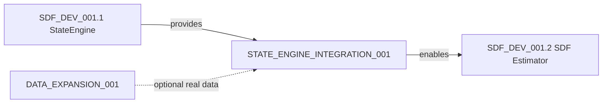

# TaskCard: STATE_ENGINE_INTEGRATION_001

| Field | Value |
|-------|-------|
| **ID** | STATE_ENGINE_INTEGRATION_001 |
| **Title** | StateEngine Real Data Integration Testing |
| **Status** | ⚠️ BLOCKED |
| **Blocked By** | DATA_EXPANSION_001 (real data unavailable) |
| **Priority** | P1 |
| **Type** | Integration |
| **Parent** | SDF_DEV_001 |
| **Created** | 2026-02-01 |
| **Last Updated** | 2026-02-02 |
| **Author** | 王数据 + 陈量化 |

---

## 1. Objective

验证 StateEngine 模块能够正确处理来自 DGSF DataEng 管道的真实市场数据，确保：
- 数据格式兼容性
- 因果性约束得到保证
- 输出数值合理性

## 2. Scope

### In-Scope
- DE5 Microstructure → StateEngine 数据桥接
- 日频收益率 → 波动率状态 (V_t) 计算
- 换手率数据 → 流动性状态 (L_t) 计算
- 合成数据 fallback 测试
- 端到端管道验证

### Out-of-Scope
- Tushare API 下载流程（依赖 DATA_EXPANSION_001）
- Crowd signal (C_t) 集成（J=5 扩展）
- 性能优化

## 3. Prerequisites

| Prerequisite | Status | Notes |
|--------------|--------|-------|
| StateEngine 单元测试通过 | ✅ VERIFIED | 22/22 tests passed |
| DE5 代码存在 | ✅ AVAILABLE | de5_microstructure_a0.py |
| numpy/scipy 可用 | ✅ VERIFIED | Python 3.12 环境 |
| pandas 可用 | ⚠️ CHECK | 需要验证 |
| 真实数据文件 | ❌ MISSING | **BLOCKING** - 等待 DATA_EXPANSION_001 完成 |

## 4. Implementation Plan

### Phase 1: Data Adapter Layer (1h)

**Task 1.1**: 创建 `StateEngineDataAdapter` 类

```python
# projects/dgsf/repo/src/dgsf/sdf/data_adapter.py
class StateEngineDataAdapter:
    """桥接 DE5 输出与 StateEngine 输入"""
    
    def from_de5_parquet(self, path: str) -> dict:
        """Load DE5 market_micro_monthly.parquet"""
        
    def from_de1_daily(self, path: str) -> dict:
        """Load DE1 daily canonical for daily-level testing"""
        
    def from_synthetic(self, T: int, N: int, seed: int) -> dict:
        """Generate synthetic data matching DE5 schema"""
```

**Acceptance Criteria**:
- [ ] 能加载 parquet 格式（如果 pandas 可用）
- [ ] 能生成兼容格式的合成数据
- [ ] 返回 dict 包含 `returns`, `turnover` 键

### Phase 2: Integration Test Suite (2h)

**Task 2.1**: 创建集成测试文件

```
projects/dgsf/repo/tests/sdf/test_state_engine_integration.py
```

**Test Cases**:

| Test ID | Description | Data Source |
|---------|-------------|-------------|
| TC-INT-001 | Synthetic data baseline | 合成数据 |
| TC-INT-002 | DE5 format compatibility | Mock DE5 parquet |
| TC-INT-003 | Large scale (T=2500, N=800) | 合成 CSI800 |
| TC-INT-004 | Edge cases (missing data) | 带 NaN 的合成数据 |
| TC-INT-005 | Causality verification | 时间戳检验 |

### Phase 3: End-to-End Pipeline (1h)

**Task 3.1**: 创建端到端测试脚本

```
projects/dgsf/scripts/test_state_engine_e2e.py
```

**Pipeline Flow**:
```
[Data Source] → [DataAdapter] → [StateEngine] → [Validation] → [Report]
     ↓               ↓              ↓              ↓            ↓
  DE5/Synthetic   Transform     compute_*     assertions    JSON/CSV
```

## 5. Data Schema Reference

### DE5 Output Schema (market_micro_monthly.parquet)

| Column | Type | StateEngine Mapping |
|--------|------|---------------------|
| `ts_code` | str | asset identifier |
| `date` | int (YYYYMM) | time index |
| `micro_monthly_return` | float64 | → returns |
| `micro_turnover_mean` | float64 | → turnover |
| `micro_realized_vol` | float64 | (validation reference) |

### StateEngine Input Requirements

| Input | Type | Shape | Constraints |
|-------|------|-------|-------------|
| `returns` | np.ndarray | (T,) or (T,N) | finite values |
| `turnover` | np.ndarray | (T,) or (T,N) | positive values |

## 6. Validation Criteria

### Numerical Validation

```python
# V_t validation
assert np.all(np.isfinite(V_t[window:]))  # No NaN after warmup
assert -5 < V_t.mean() < 5  # Standardized range

# L_t validation  
assert np.all(np.isfinite(L_t[window:]))
assert -5 < L_t.mean() < 5

# Causality check
# V_t[t] should only depend on returns[:t+1]
```

### Statistical Validation

| Metric | Expected | Tolerance |
|--------|----------|-----------|
| V_t mean | ~0 | ±0.1 |
| V_t std | ~1 | ±0.2 |
| V_t autocorr(1) | >0.5 | - |
| L_t correlation with turnover | >0.8 | - |

## 7. Deliverables

| Deliverable | Path | Status |
|-------------|------|--------|
| DataAdapter | `repo/src/dgsf/sdf/data_adapter.py` | ✅ DONE |
| Integration Tests | `repo/tests/sdf/test_state_engine_integration.py` | ✅ DONE (12/12 passed) |
| E2E Script | `scripts/test_state_engine_e2e.py` | ✅ DONE (7/7 passed) |
| Test Report | `reports/state_engine_e2e_report.json` | ✅ DONE |

## 8. Dependencies



## 9. Risk Assessment

| Risk | Probability | Impact | Mitigation |
|------|-------------|--------|------------|
| pandas 未安装 | Medium | High | 使用纯 numpy fallback |
| 无 Tushare Token | High | Medium | 合成数据 fallback |
| 数据格式不匹配 | Low | Medium | Adapter 层隔离 |

## 10. Exit Criteria

- [ ] DataAdapter 能正确加载/生成数据
- [ ] 5/5 集成测试用例通过
- [ ] E2E 脚本成功执行并生成报告
- [ ] 代码通过 CI/CD gate check

---

**Next Actions**:
1. 验证 pandas 环境
2. 实现 DataAdapter
3. 编写集成测试
4. 运行 E2E 验证
